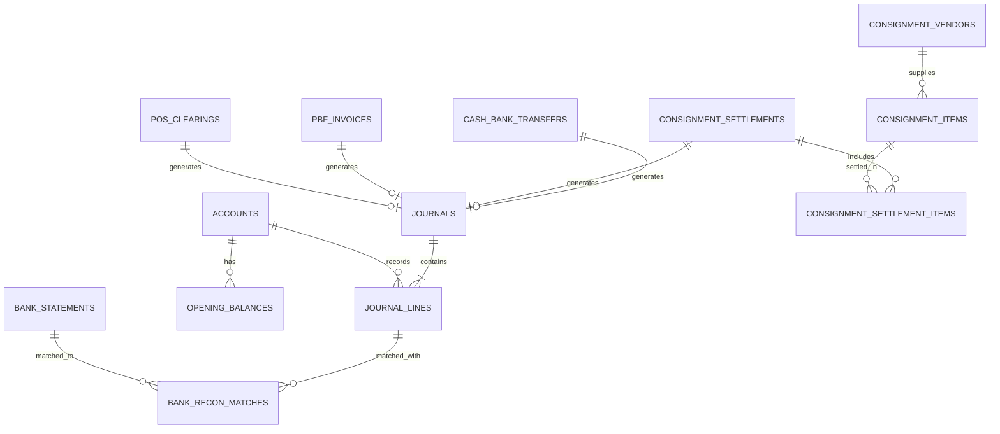

# Rancangan Skema Database (Database Schema Design)

## Sistem Keuangan Apotek (SQLite & Drizzle ORM)

Dokumen ini memuat relasi antar tabel, tipe data SQLite, standar presisi finansial, indeks, dan integritas transaksi pada sistem akuntansi apotek.

---

## 1. Standar Data Finansial & Konfigurasi SQLite

Karena SQLite tidak memiliki tipe bawaan `DECIMAL(18, 4)` seperti RDBMS enterprise, sistem menerapkan standar ketat untuk menjamin **nol deviasi/pembulatan floating point**:

1. **Penyimpanan Nominal (Financial Precision):**
   - Disimpan sebagai **`INTEGER`** (dalam satuan _sen_ / minor units: $1\text{ IDR} = 100\text{ sen}$, atau rupiah bulat sesuai kebutuhan) atau **`TEXT`** (string angka fixed-point).
   - Di layer aplikasi (Backend & Frontend), angka diolah menggunakan library **`decimal.js`** / **`dinero.js`** untuk operasi perkalian PPN 11%, DPP, bagi hasil konsinyasi, dan validasi $\sum \text{Debit} = \sum \text{Kredit}$.
2. **Pragma SQLite untuk Integritas Transaksi & Concurrency:**
   ```sql
   PRAGMA journal_mode = WAL;        -- Write-Ahead Logging untuk high concurrency
   PRAGMA foreign_keys = ON;         -- Enforce foreign key constraints
   PRAGMA busy_timeout = 5000;       -- Timeout 5 detik untuk menghindari SQLITE_BUSY
   PRAGMA synchronous = NORMAL;      -- Optimal balance antara durability & kecepatan
   ```
3. **Primary Key:** `TEXT` berisi format UUIDv4 / ULID (`cuid2` / `nanoid` / `uuidv7`).

---

## 2. Diagram Relasi Entitas (ERD Overview)



---

## 3. Struktur Tabel SQLite (DDL)

### 3.1 `accounts` (Bagan Akun / CoA)

Menyimpan struktur hierarki rekening akuntansi.

```sql
CREATE TABLE accounts (
    id TEXT PRIMARY KEY NOT NULL,
    code TEXT NOT NULL UNIQUE,              -- Contoh: '1101', '2100'
    name TEXT NOT NULL,                     -- Contoh: 'Kas Toko / Kasir'
    parent_id TEXT REFERENCES accounts(id) ON DELETE RESTRICT,
    classification TEXT NOT NULL,            -- 'ASET_LANCAR', 'KEWAJIBAN_LANCAR', 'EKUITAS', 'PENDAPATAN', 'BEBAN'
    normal_balance TEXT NOT NULL,            -- 'DEBIT' atau 'KREDIT'
    level INTEGER NOT NULL DEFAULT 1,       -- Indentasi visual (1, 2, 3)
    is_active INTEGER NOT NULL DEFAULT 1,   -- 1 = True, 0 = False
    created_at TEXT DEFAULT (datetime('now')),
    updated_at TEXT DEFAULT (datetime('now'))
);
CREATE INDEX idx_accounts_code ON accounts(code);
CREATE INDEX idx_accounts_parent ON accounts(parent_id);
```

### 3.2 `opening_balances` (Saldo Awal Periode)

Menyimpan saldo awal per tanggal cut-off migrasi.

```sql
CREATE TABLE opening_balances (
    id TEXT PRIMARY KEY NOT NULL,
    cutoff_date TEXT NOT NULL,              -- Format ISO: 'YYYY-MM-DD'
    account_id TEXT NOT NULL REFERENCES accounts(id) ON DELETE CASCADE,
    debit_amount INTEGER NOT NULL DEFAULT 0,  -- Disimpan dalam sen (nominal * 100)
    credit_amount INTEGER NOT NULL DEFAULT 0, -- Disimpan dalam sen (nominal * 100)
    notes TEXT,
    is_locked INTEGER NOT NULL DEFAULT 0,
    created_by TEXT,
    created_at TEXT DEFAULT (datetime('now')),
    UNIQUE(cutoff_date, account_id)
);
```

### 3.3 `journals` & `journal_lines` (Buku Jurnal Ganda)

Inti transaksi _double-entry accounting_ yang divalidasi balance.

```sql
CREATE TABLE journals (
    id TEXT PRIMARY KEY NOT NULL,
    journal_no TEXT NOT NULL UNIQUE,        -- Format: 'JU-202609-0001'
    entry_date TEXT NOT NULL,               -- Format: 'YYYY-MM-DD'
    reference_no TEXT,                      -- No. Faktur / No. Ref POS / No. Mutasi Bank
    source_module TEXT NOT NULL,            -- 'GENERAL', 'POS_CLEARING', 'PBF_INVOICE', 'CONSIGNMENT', 'CASH_BANK'
    source_id TEXT,                         -- ID referensi entitas asal
    memo TEXT,
    is_posted INTEGER NOT NULL DEFAULT 1,
    created_by TEXT,
    created_at TEXT DEFAULT (datetime('now')),
    updated_at TEXT DEFAULT (datetime('now'))
);

CREATE TABLE journal_lines (
    id TEXT PRIMARY KEY NOT NULL,
    journal_id TEXT NOT NULL REFERENCES journals(id) ON DELETE CASCADE,
    line_number INTEGER NOT NULL,
    account_id TEXT NOT NULL REFERENCES accounts(id) ON DELETE RESTRICT,
    description TEXT,
    debit INTEGER NOT NULL DEFAULT 0,       -- Nilai dalam satuan sen
    credit INTEGER NOT NULL DEFAULT 0,      -- Nilai dalam satuan sen
    CHECK (debit >= 0 AND credit >= 0),
    CHECK (debit > 0 OR credit > 0)
);
CREATE INDEX idx_journal_lines_account_id ON journal_lines(account_id);
CREATE INDEX idx_journal_lines_journal_id ON journal_lines(journal_id);
```

### 3.4 `pos_clearings` (Rekapitulasi Harian POS)

```sql
CREATE TABLE pos_clearings (
    id TEXT PRIMARY KEY NOT NULL,
    clearing_date TEXT NOT NULL,
    shift_name TEXT,
    cashier_name TEXT,
    total_pos_omzet INTEGER NOT NULL DEFAULT 0,
    cash_received INTEGER NOT NULL DEFAULT 0,
    non_cash_received INTEGER NOT NULL DEFAULT 0, -- QRIS + EDC
    physical_cash_diff INTEGER NOT NULL DEFAULT 0, -- Selisih kas fisik
    cogs_amount INTEGER NOT NULL DEFAULT 0,        -- Nilai HPP harian
    journal_id TEXT REFERENCES journals(id) ON DELETE SET NULL,
    status TEXT NOT NULL DEFAULT 'DRAFT',          -- 'DRAFT', 'POSTED'
    created_at TEXT DEFAULT (datetime('now'))
);
```

### 3.5 `pbf_invoices` (Faktur Pembelian PBF / Utang Usaha)

```sql
CREATE TABLE pbf_invoices (
    id TEXT PRIMARY KEY NOT NULL,
    invoice_date TEXT NOT NULL,
    due_date TEXT NOT NULL,
    pbf_name TEXT NOT NULL,
    invoice_number TEXT NOT NULL,
    dpp_amount INTEGER NOT NULL DEFAULT 0,
    ppn_amount INTEGER NOT NULL DEFAULT 0,
    total_amount INTEGER NOT NULL DEFAULT 0,
    payment_terms TEXT NOT NULL,                    -- 'TUNAI', 'TEMPO_14', 'TEMPO_30', dll
    account_payable_id TEXT NOT NULL REFERENCES accounts(id) ON DELETE RESTRICT,
    is_verified INTEGER NOT NULL DEFAULT 0,
    payment_status TEXT NOT NULL DEFAULT 'UNPAID',  -- 'UNPAID', 'OVERDUE', 'PAID'
    journal_id TEXT REFERENCES journals(id) ON DELETE SET NULL,
    created_at TEXT DEFAULT (datetime('now')),
    UNIQUE(pbf_name, invoice_number)                -- Pencegahan duplikasi faktur
);
```

### 3.6 `consignment_items` & `consignment_settlements`

```sql
CREATE TABLE consignment_vendors (
    id TEXT PRIMARY KEY NOT NULL,
    vendor_name TEXT NOT NULL,
    contact_person TEXT,
    phone TEXT,
    bank_account_info TEXT
);

CREATE TABLE consignment_items (
    id TEXT PRIMARY KEY NOT NULL,
    vendor_id TEXT NOT NULL REFERENCES consignment_vendors(id) ON DELETE RESTRICT,
    product_name TEXT NOT NULL,
    qty_sold INTEGER NOT NULL DEFAULT 0,
    agreed_cost_price INTEGER NOT NULL DEFAULT 0,    -- Harga beli titip jual per unit (sen)
    total_payable INTEGER NOT NULL DEFAULT 0,        -- qty_sold * agreed_cost_price
    status TEXT NOT NULL DEFAULT 'READY_TO_PAY',     -- 'READY_TO_PAY', 'PAID'
    created_at TEXT DEFAULT (datetime('now'))
);

CREATE TABLE consignment_settlements (
    id TEXT PRIMARY KEY NOT NULL,
    settlement_no TEXT NOT NULL UNIQUE,
    settlement_date TEXT NOT NULL,
    total_paid INTEGER NOT NULL,
    payment_account_id TEXT NOT NULL REFERENCES accounts(id) ON DELETE RESTRICT,
    reference_no TEXT,
    journal_id TEXT REFERENCES journals(id) ON DELETE SET NULL,
    created_at TEXT DEFAULT (datetime('now'))
);

CREATE TABLE consignment_settlement_items (
    settlement_id TEXT NOT NULL REFERENCES consignment_settlements(id) ON DELETE CASCADE,
    consignment_item_id TEXT NOT NULL REFERENCES consignment_items(id) ON DELETE RESTRICT,
    PRIMARY KEY(settlement_id, consignment_item_id)
);
```

### 3.7 `cash_bank_transfers` (Mutasi Kas & Bank)

```sql
CREATE TABLE cash_bank_transfers (
    id TEXT PRIMARY KEY NOT NULL,
    transaction_time TEXT NOT NULL,
    transaction_type TEXT NOT NULL,                 -- 'DEPOSIT', 'BANK_TRANSFER', 'EXPENSE', 'OTHER'
    source_account_id TEXT NOT NULL REFERENCES accounts(id) ON DELETE RESTRICT,
    target_account_id TEXT NOT NULL REFERENCES accounts(id) ON DELETE RESTRICT,
    net_amount INTEGER NOT NULL DEFAULT 0,
    admin_fee INTEGER NOT NULL DEFAULT 0,
    total_deducted INTEGER NOT NULL DEFAULT 0,       -- net_amount + admin_fee
    reference_no TEXT,
    memo TEXT,
    journal_id TEXT REFERENCES journals(id) ON DELETE SET NULL,
    created_at TEXT DEFAULT (datetime('now'))
);
```

### 3.8 `bank_statements` & `bank_reconciliations`

```sql
CREATE TABLE bank_statements (
    id TEXT PRIMARY KEY NOT NULL,
    bank_account_id TEXT NOT NULL REFERENCES accounts(id) ON DELETE RESTRICT,
    statement_date TEXT NOT NULL,
    description TEXT,
    debit INTEGER NOT NULL DEFAULT 0,
    credit INTEGER NOT NULL DEFAULT 0,
    is_matched INTEGER NOT NULL DEFAULT 0,
    imported_at TEXT DEFAULT (datetime('now'))
);

CREATE TABLE bank_recon_matches (
    id TEXT PRIMARY KEY NOT NULL,
    bank_statement_id TEXT NOT NULL REFERENCES bank_statements(id) ON DELETE CASCADE,
    journal_line_id TEXT NOT NULL REFERENCES journal_lines(id) ON DELETE CASCADE,
    matched_at TEXT DEFAULT (datetime('now')),
    match_type TEXT NOT NULL DEFAULT 'MANUAL',      -- 'AUTO', 'MANUAL'
    UNIQUE(bank_statement_id, journal_line_id)
);
```
