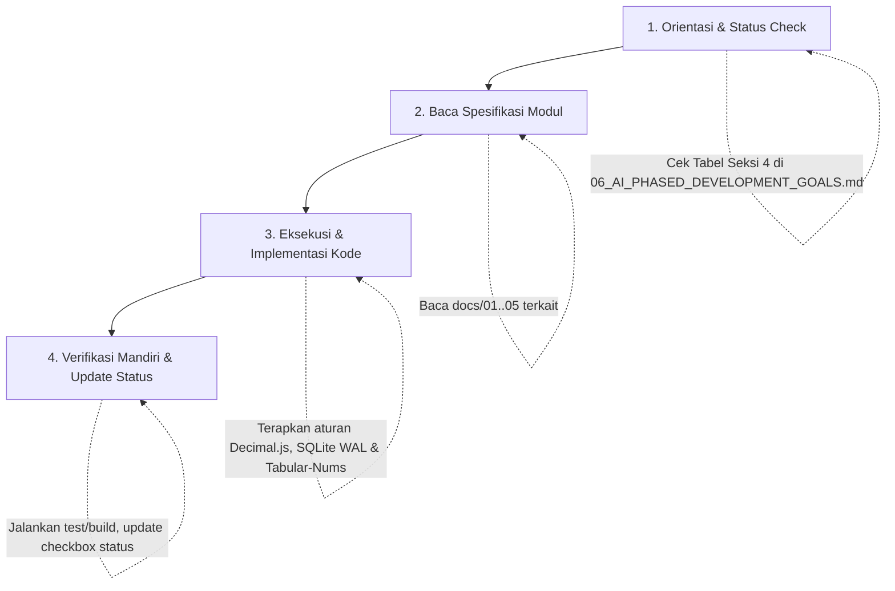

# Panduan & Sasaran Pengembangan AI Berkelanjutan (AI Phased Development Playbook)
## Sistem Keuangan Apotek (Full-Stack TypeScript, SQLite WAL & React)

---

## 📌 1. Pendahuluan & Sasaran Utama AI (AI Mission Statement)

Dokumen ini adalah **panduan eksekusi master jangka panjang (*Long-Term AI Execution Blueprint*)** yang dirancang agar asisten AI (maupun pengembang manusia) dapat melanjutkan pengembangan aplikasi **Sistem Keuangan Apotek** secara bertahap (*in phases*), konsisten, bebas regresi, dan terukur dari awal hingga tuntas.

Setiap fase memiliki **tujuan spesifik, berkas target, langkah kerja teknis, kriteria verifikasi mandiri (*Self-Verification Checklist*), dan Definisi Selesai (*Definition of Done*)**.

---

## 🧠 2. Prinsip & Aturan Wajib untuk AI (AI Operating Directives)

Setiap sesi AI yang bekerja pada repositori ini **wajib mematuhi 6 prinsip mutlak** berikut:

1. **Zero-Drift Accounting (Presisi Finansial Nol Eror):**
   - Di database SQLite, seluruh nilai moneter disimpan sebagai `INTEGER` dalam satuan **sen** ($1\text{ IDR} = 100\text{ sen}$) atau nominal rupiah bulat konsisten.
   - Di aplikasi (TypeScript), gunakan **`decimal.js`** untuk seluruh kalkulasi (DPP, PPN 11%, bagi hasil, selisih debit-kredit). Dilarang keras menggunakan floating point matematika biasa (`+`, `-`, `*`, `/`) untuk nominal uang.
2. **Kaidah Double-Entry & Keseimbangan Jurnal:**
   - Setiap transaksi yang masuk ke buku besar (`journals` + `journal_lines`) wajib memenuhi:
     $$\sum \text{Debit} = \sum \text{Kredit}$$
   - Tombol posting/simpan wajib dinonaktifkan di UI jika selisih $\neq 0$.
3. **Ergonomi Data Grid & Navigasi Keyboard Penuh:**
   - Seluruh tabel input mengadopsi prinsip spreadsheet: `Tab`, `Shift+Tab`, `Enter`, `F2`, `Esc`, `Ctrl+Z`, dan `Ctrl+V` (Paste dari Excel).
   - Format angka wajib menggunakan `tabular-nums` (monospaced figures) rata kanan.
4. **End-to-End Type Safety:**
   - Monorepo berbasis `pnpm workspace`. Dilarang menduplikasi definisi tipe data antara API dan Frontend. Skema validasi input wajib terpusat di `packages/shared` menggunakan **Zod**.
5. **Konfigurasi SQLite yang Tangguh:**
   - SQLite wajib berjalan dalam mode `WAL`, `foreign_keys = ON`, `busy_timeout = 5000`, dan `synchronous = NORMAL`.
6. **Protokol Resume Sesi AI & Kompatibilitas Multi-Platform:**
   - Proyek berjalan di lingkungan pengembangan campuran (*cross-platform / mixed dev environment*). Pastikan seluruh script, path, dan tooling bersifat portabel dan OS-agnostik.
   - Saat memulai sesi baru, AI wajib memeriksa seksi **4. Matriks Kemajuan & Status Fase** untuk menentukan tugas berikutnya, membaca dokumen spesifikasi terkait di folder `docs/`, dan menjalankan verifikasi sebelum berpindah ke tugas baru.

---

## 🏗️ 3. Arsitektur Monorepo & Peta Berkas Target

```text
KeuanganApotek/
├── docs/                               # Dokumentasi Spesifikasi & Roadmap
│   ├── 01_PRD.md                       # Product Requirements Document
│   ├── 02_UI_UX_SPECIFICATION.md       # Spesifikasi Grid, UX & Keyboard
│   ├── 03_ACCOUNTING_LOGIC_AND_COA.md  # Bagan Akun Standar & Logika Jurnal
│   ├── 04_DATABASE_SCHEMA.md           # DDL Skema SQLite & Drizzle ORM
│   ├── 05_DEVELOPMENT_ROADMAP.md       # Roadmap Umum
│   ├── 06_AI_PHASED_DEVELOPMENT_GOALS.md # Master AI Execution Playbook (Dokumen Ini)
│   └── 07_TESTING_STRATEGY_AND_TEST_SUITES.md # Strategi Pengujian & Test Suites
│
├── apps/
│   ├── api/                            # Backend Server (tRPC / Hono + Drizzle ORM + SQLite)
│   │   ├── src/
│   │   │   ├── db/
│   │   │   │   ├── schema/             # Drizzle schemas (accounts, journals, pbf, pos, dll.)
│   │   │   │   ├── client.ts           # better-sqlite3 WAL connection
│   │   │   │   ├── seed.ts             # Default Pharmacy CoA & mock data
│   │   │   │   └── migrate.ts          # Migration runner
│   │   │   ├── routers/                # tRPC / Hono Routers (coa, journal, pos, pbf, recon, reports)
│   │   │   ├── services/               # Double-entry ledger service, balancing engine
│   │   │   ├── context.ts              # Request context
│   │   │   └── server.ts               # Server entry point
│   │   ├── package.json
│   │   └── tsconfig.json
│   │
│   └── web/                            # Frontend Client (Vite + React 18/19 + Tailwind + TanStack)
│       ├── src/
│       │   ├── components/
│       │   │   ├── grid/               # TanStack Data Grid, Sticky Balance Bar, Excel Paste Hook
│       │   │   ├── layout/             # AppLayout, Sidebar, Topbar, Breadcrumbs
│       │   │   ├── ui/                 # Button, Modal, Badge, Drawer, Input
│       │   │   └── drilldown/          # Slide-over Drawer for Financial Reports
│       │   ├── hooks/                  # useKeyboardNav, useUndoRedo, useExcelPaste
│       │   ├── pages/
│       │   │   ├── CoAPage.tsx          # Modul 1: CoA & Saldo Awal Dual Mode
│       │   │   ├── GeneralJournalPage.tsx # Modul 2: Jurnal Umum
│       │   │   ├── POSClearingPage.tsx  # Modul 3: POS Clearing & HPP
│       │   │   ├── PBFInvoicesPage.tsx  # Modul 4: PBF AP Batch Ledger
│       │   │   ├── ConsignmentPage.tsx  # Modul 5: Konsinyasi & Bagi Hasil
│       │   │   ├── CashBankPage.tsx     # Modul 6: Kas & Bank Register
│       │   │   ├── BankReconPage.tsx    # Modul 7: Rekonsiliasi Dual-Pane
│       │   │   └── ReportsPage.tsx      # Modul 8: Laporan Laba Rugi, Neraca, Neraca Saldo
│       │   ├── lib/                    # tRPC / API client, TanStack Query client
│       │   ├── utils/                  # formatRupiah, parseRupiah, dateHelpers
│       │   ├── App.tsx
│       │   └── main.tsx
│       ├── package.json
│       ├── vite.config.ts
│       └── tsconfig.json
│
├── packages/
│   └── shared/                         # Shared Types, Zod Schemas & Financial Math
│       ├── src/
│       │   ├── schemas/                # Zod schemas (coaSchema, journalSchema, pbfSchema, etc.)
│       │   ├── types/                  # Inferred TypeScript interfaces
│       │   └── math/                   # decimal.js helpers (calcPPN, calcDPP, sumDebitCredit)
│       ├── package.json
│       └── tsconfig.json
│
├── drizzle.config.ts                   # Drizzle Kit Configuration
├── package.json                        # Root Workspace Configuration
├── pnpm-workspace.yaml                 # Monorepo Workspace Definitions
└── tsconfig.base.json                  # Base TypeScript Configuration
```

---

## 📊 4. Matriks Kemajuan & Status Fase (Progress Tracker)

> **Instruksi untuk AI:** Perbarui status di bawah ini (`[ ]` menjadi `[x]`) setiap kali sebuah fase atau tugas selesai diuji.

| Fase | Nama Fase | Fokus Utama | Status |
| :---: | :--- | :--- | :---: |
| **0** | **Monorepo Foundation & Tooling Setup** | Workspace pnpm, TypeScript, Tailwind, Drizzle, tRPC/Hono scaffold | `[x] Selesai diverifikasi (Node 22)` |
| **1** | **Database Schema, Master CoA & Opening Balance** | SQLite WAL, Drizzle migration, Tree-Grid CoA, Auto-Balancing Equity | `[ ] Belum Mulai` |
| **2** | **Double-Entry Engine & General Journal Grid** | Service Buku Besar, Grid Jurnal Umum, Sticky Balance Bar, Hotkeys | `[ ] Belum Mulai` |
| **3** | **Modul Transaksi Operasional Apotek** | POS Clearing + HPP, Faktur PBF (Excel paste), Konsinyasi, Kas & Bank | `[ ] Belum Mulai` |
| **4** | **Rekonsiliasi Bank Dual-Pane** | Split View, Algoritma Auto-Match tanggal/nominal, Matching manual | `[ ] Belum Mulai` |
| **5** | **Laporan Keuangan Dinamis & Drill-Down Drawer** | Laba Rugi Komparatif, Neraca, Neraca Saldo, Drawer rincian jurnal | `[ ] Belum Mulai` |
| **6** | **Pengujian Beban, Audit Trail & Penguncian Periode** | Stress test grid >5.000 baris, Lock Period, SQLite backup WAL | `[ ] Belum Mulai` |
| **7** | **Fitur Ekstensi Lanjutan (Future Scope)** | Ekspor Pajak (e-Faktur), Webhook POS Integration, Multi-Cabang | `[ ] Belum Mulai` |

---

## 🚀 5. Rincian Eksekusi Fase Demi Fase (Step-by-Step AI Execution Guide)

---

### 🔹 FASE 0: Monorepo Foundation & Tooling Setup
**Tujuan:** Membangun fondasi monorepo `pnpm workspace`, paket shared types, template aplikasi frontend Vite + React + Tailwind, dan server backend dengan SQLite.

#### 📝 Tugas Spesifik AI:
1. **Inisialisasi Monorepo:**
   - Buat `package.json` root, `pnpm-workspace.yaml`, dan `tsconfig.base.json`.
   - Setup folder `apps/api`, `apps/web`, dan `packages/shared`.
2. **Setup `packages/shared`:**
   - Install `zod`, `decimal.js`, dan TypeScript.
   - Buat fungsi pembantu matematika finansial di `packages/shared/src/math/index.ts` (penjumlahan, perkalian PPN 11%, validasi sen).
3. **Setup `apps/api`:**
   - Setup Node.js/Bun server dengan Hono/tRPC, `better-sqlite3`, `drizzle-orm`, dan `drizzle-kit`.
   - Konfigurasi koneksi SQLite dengan mode WAL dan Foreign Keys ON di `client.ts`.
4. **Setup `apps/web`:**
   - Setup Vite + React (TypeScript) + Tailwind CSS + Lucide Icons + TanStack Query + TanStack Table v8.
   - Siapkan shell layout dasar (Sidebar, Top Navigation Bar, Content Container).
5. **Setup Test Harness (Vitest & Playwright):**
   - Konfigurasi Vitest di `packages/shared` dan `apps/api` untuk unit & integration tests.
   - Setup Playwright di `apps/web` untuk E2E testing data grid dan interaksi keyboard.

#### 🧪 Kriteria Verifikasi (Self-Verification):
- Jalankan `pnpm install` tanpa error resolusi paket.
- Jalankan `pnpm --filter shared build` dan pastikan shared types berhasil diimpor oleh `api` dan `web`.
- Server API dapat menyala dan merespons ping/health check.
- Aplikasi web dapat di-build dengan `pnpm --filter web build` tanpa error TypeScript.
- Jalankan `pnpm test` $\rightarrow$ Vitest runner berhasil dieksekusi tanpa error konfigurasi.

---

### 🔹 FASE 1: Database Schema, Master CoA & Opening Balance Engine
**Tujuan:** Mengimplementasikan skema database akuntansi apotek, seeding master akun standar, dan antarmuka pohon akun (CoA) dengan dual mode (Struktur vs Saldo Awal).

#### 📝 Tugas Spesifik AI:
1. **Implementasi Drizzle Schema SQLite (`apps/api/src/db/schema/`):**
   - Buat skema `accounts` (kode, nama, klasifikasi, saldo_normal, level, parent_id).
   - Buat skema `opening_balances` (cutoff_date, account_id, debit_amount, credit_amount, is_locked).
   - Buat skema `journals` dan `journal_lines` sesuai `docs/04_DATABASE_SCHEMA.md`.
2. **Seeding Master Akun Apotek:**
   - Buat skrip seed `seed.ts` yang mengisi 4-digit CoA standar apotek (1101 Kas Toko, 1301 Persediaan Obat Resep, 2100 Utang PBF, 3101 Ekuitas Saldo Awal, 4101 Penjualan OTC, 5101 HPP Resep, dll. sesuai `docs/03_ACCOUNTING_LOGIC_AND_COA.md`).
3. **API Endpoints (CoA & Opening Balance Router):**
   - Query: `getAccountsTree`, `getOpeningBalances(cutoffDate)`.
   - Mutation: `upsertAccount`, `deleteAccount`, `saveOpeningBalances`, `lockOpeningBalance`.
   - Service: Algoritma *Auto-Balancing Equity* (menghitung selisih Total Debit - Total Kredit dan otomatis mengalokasikan ke `3101 - Ekuitas Saldo Awal`).
4. **Frontend UI: Modul 1 (Bagan Akun & Saldo Awal):**
   - Halaman `CoAPage.tsx` dengan toggle: **Mode Struktur Akun** vs **Mode Input Saldo Awal**.
   - Tree-Grid dengan visual auto-indentation berdasarkan level akun.
   - Bottom Sticky Balance Bar (Menampilkan Total Debit, Total Kredit, Selisih, dan tombol *Alokasikan Selisih ke Ekuitas*).
   - Tombol Kunci Saldo Awal (*Lock Period*) yang memicu pembuatan Jurnal Pembuka otomatis.

#### 🧪 Kriteria Verifikasi (Self-Verification):
- Migrasi database berjalan sukses (`pnpm db:push` / `pnpm db:migrate`).
- Seeding mengisi minimal 30 akun standar apotek.
- Masukkan saldo awal yang tidak seimbang di UI $\rightarrow$ Sticky Balance Bar berubah warna merah $\rightarrow$ Klik "Auto-Balancing" $\rightarrow$ Saldo otomatis seimbang dan tombol simpan menjadi aktif.
- Simpan Saldo Awal $\rightarrow$ Terbentuk entri pada tabel `journals` bertipe `OPENING_BALANCE`.

---

### 🔹 FASE 2: Core Double-Entry Engine & General Journal Grid
**Tujuan:** Membangun mesin jurnal umum berpasangan dengan validasi keseimbangan multi-baris dan interaksi keyboard super cepat.

#### 📝 Tugas Spesifik AI:
1. **Core Accounting Service (`apps/api/src/services/ledger.service.ts`):**
   - Fungsi `createJournalEntry({ entryDate, referenceNo, memo, sourceModule, lines })`.
   - Enforce constraint ACID: $\sum \text{debit} = \sum \text{credit}$ di dalam transaksi database SQLite (`db.transaction()`).
2. **API Endpoint Jurnal Umum:**
   - Query: `listJournals({ startDate, endDate, sourceModule })`, `getJournalById(id)`.
   - Mutation: `createGeneralJournal`, `updateJournal`, `deleteJournal` (hanya jika periode belum dikunci).
3. **Frontend UI: Modul 2 (Jurnal Umum Data Grid):**
   - Halaman `GeneralJournalPage.tsx`.
   - Form multi-baris: No, Autocomplete Akun (Kode/Nama), Keterangan, Debit (Rp), Kredit (Rp), Aksi Hapus.
   - Navigasi Keyboard: Tekan `Tab` di kolom Kredit baris terakhir otomatis membuat baris kosong baru.
   - Live Sticky Balance Bar di bagian bawah layar dengan tombol "Posting Jurnal" yang dinonaktifkan jika out-of-balance.

#### 🧪 Kriteria Verifikasi (Self-Verification):
- Uji coba posting jurnal dengan Debit Rp 1.000.000 dan Kredit Rp 900.000 $\rightarrow$ Sistem API wajib menolak dengan error validation Zod / Business Rule.
- Posting jurnal seimbang $\rightarrow$ Data tersimpan di `journals` dan `journal_lines` dengan foreign key valid.
- Verifikasi format rupiah dan monospaced angka (`tabular-nums`) di UI.

---

### 🔹 FASE 3: Modul Transaksi Operasional Apotek (Operational Modules)
**Tujuan:** Mengimplementasikan 4 modul transaksi spesifik apotek yang otomatis membentuk jurnal tanpa input debit-kredit manual.

#### 📝 Tugas Spesifik AI:

#### 3.1 Modul POS Clearing & Pengakuan HPP Harian (`POSClearingPage.tsx`)
- Tabel rekapitulasi harian per tanggal: Total Omzet POS, Penerimaan Tunai, QRIS/EDC, Selisih Kas Fisik, dan Nilai Modal Obat (HPP).
- Tombol 1-klik *"Generate Jurnal"*:
  - Debit 1101 (Kas Toko), Debit 1120 (Kliring QRIS/EDC), Debit 6106 / Kredit 4900 (Selisih Kasir), Kredit 4101/4102 (Penjualan).
  - Debit 5101 (HPP), Kredit 1301 (Persediaan Obat).

#### 3.2 Modul Faktur Pembelian PBF & Utang Usaha (`PBFInvoicesPage.tsx`)
- Data grid batch entri faktur PBF: Tgl Faktur, Tgl Jatuh Tempo, Nama Distributor, No. Faktur, DPP, PPN 11%, Total Tagihan, Termin Bayar.
- Fitur **Paste from Excel (`Ctrl + V`)**: Parser clipboard multi-baris tab-separated values (TSV) langsung mengisi kolom grid.
- Deteksi duplikasi nomor faktur per nama PBF secara instan di UI dan backend unique constraint.
- Otomatisasi Jurnal: Debit 1301 (Persediaan), Debit 1400 (PPN Masukan), Kredit 2100 (Utang Usaha PBF).

#### 3.3 Modul Konsinyasi & Bagi Hasil (`ConsignmentPage.tsx`)
- Tabel barang titip jual (suplemen herbal, madu, alkes): Nama Vendor, Nama Produk, Qty Terjual, Harga Bagi Hasil, Total Utang.
- Multi-select checkbox dengan **Floating Action Bar**: *"Selesaikan Tagihan Terpilih (X Item) — Total Rp Y"*.
- Eksekusi pembayaran menghasilkan jurnal: Debit 2110 (Utang Konsinyasi), Kredit Kas/Bank.

#### 3.4 Modul Kas, Bank & Mutasi Rekening (`CashBankPage.tsx`)
- Kartu ringkasan saldo: Kas Toko, Bank BCA, Bank Mandiri.
- Tabel mutasi: Setoran Kasir ke Bank, Transfer Antar Bank, Pembebanan Biaya Admin (misal Rp 2.500 BI-FAST).
- Otomatisasi mutasi ganda: Debit Bank Tujuan, Debit 6201 (Biaya Admin), Kredit Akun Sumber.

#### 🧪 Kriteria Verifikasi (Self-Verification):
- Copy 5 baris data faktur dari Excel/Notepad $\rightarrow$ Tekan `Ctrl + V` di grid PBF $\rightarrow$ 5 baris terisi otomatis dengan kalkulasi DPP & PPN 11% yang akurat.
- Rekap POS dengan selisih kas fisik minus Rp 5.000 $\rightarrow$ Klik Generate Jurnal $\rightarrow$ Jurnal terbentuk dengan akun `6106 - Beban Selisih Kasir Minus` tercatat Rp 5.000.
- Eksekusi pembayaran konsinyasi multi-select $\rightarrow$ Status item berubah menjadi `PAID` dan jurnal kas keluar terbentuk.

---

### 🔹 FASE 4: Rekonsiliasi Bank Dual-Pane & Algoritma Auto-Match
**Tujuan:** Membangun modul pencocokan mutasi rekening koran bank dengan pencatatan pembukuan internal secara visual berdampingan.

#### 📝 Tugas Spesifik AI:
1. **Schema & Import Bank Statement:**
   - Tabel `bank_statements` dan `bank_recon_matches`.
   - Parser impor mutasi bank (format CSV / Excel rekening koran BCA & Mandiri).
2. **Algoritma Auto-Match (`recon.service.ts`):**
   - Cari pasangan mutasi internal vs rekening koran dengan kriteria:
     - Akun bank sama.
     - Tanggal mutasi dalam rentang $\pm 1$ hari kalender.
     - Nominal identik (debit bank = kredit sistem, atau sebaliknya).
3. **Frontend UI: Modul 7 (`BankReconPage.tsx`):**
   - Dual Pane Split View (Panel Kiri: Mutasi Buku Besar Sistem | Panel Kanan: Rekening Koran Bank).
   - Tombol "Auto-Match Semua Transaksi Sesuai".
   - Fitur Manual Matching: Pilih baris di kiri & kanan lalu klik "Tautkan (Link)".
   - Status bar keselarasan: Total Bank, Total Sistem, Selisih Belum Cocok.

#### 🧪 Kriteria Verifikasi (Self-Verification):
- Upload file CSV rekening koran mock $\rightarrow$ Data masuk ke panel kanan.
- Klik "Auto-Match" $\rightarrow$ Baris dengan nominal dan tanggal sesuai otomatis berstatus `MATCHED` dan diberi tanda centang hijau.
- Manual link matching berfungsi untuk transaksi dengan selisih tanggal > 1 hari.

---

### 🔹 FASE 5: Laporan Keuangan Dinamis & Drill-Down Drawer
**Tujuan:** Menghasilkan laporan Laba Rugi Komparatif, Neraca, dan Neraca Saldo real-time dengan fitur inspeksi transaksi asal (*drill-down*).

#### 📝 Tugas Spesifik AI:
1. **Financial Reporting Calculation Engine (`reports.service.ts`):**
   - **Laba Rugi Komparatif:** Pendapatan Penjualan - HPP Obat = Laba Kotor; Laba Kotor - Beban Operasional = Laba Bersih Usaha (dengan perbandingan Bulan Ini vs Bulan Lalu dan persentase pertumbuhan).
   - **Neraca (Balance Sheet):** Total Aset = Total Kewajiban + Total Ekuitas (termasuk Laba Periode Berjalan).
   - **Neraca Saldo (Trial Balance):** Daftar seluruh saldo akhir akun debit & kredit.
2. **API Endpoint Laporan & Drill-Down:**
   - `getIncomeStatement({ period, comparePeriod })`.
   - `getBalanceSheet({ asOfDate })`.
   - `getTrialBalance({ startDate, endDate })`.
   - `getAccountJournalDrillDown({ accountId, startDate, endDate })`.
3. **Frontend UI: Modul 8 (`ReportsPage.tsx` & `DrillDownDrawer.tsx`):**
   - Tab navigasi Laba Rugi, Neraca, Neraca Saldo.
   - Sel nominal angka berjarak tetap (`tabular-nums`) dan dapat diklik (*clickable*).
   - **Slide-over Drawer:** Saat nominal diklik, drawer muncul dari kanan menampilkan daftar jurnal lengkap yang menyusun angka tersebut.

#### 🧪 Kriteria Verifikasi (Self-Verification):
- Verifikasi persamaan dasar akuntansi pada Neraca:
  $$\text{Total Aset} == \text{Total Kewajiban} + \text{Total Ekuitas}$$
- Klik baris nominal "HPP Obat Resep" pada Laba Rugi $\rightarrow$ Drawer membuka dan menampilkan daftar jurnal POS Clearing dan jurnal penyesuaian terkait.

---

### 🔹 FASE 6: Pengujian Beban, Audit Trail & Penguncian Periode (Hardening)
**Tujuan:** Memastikan keandalan sistem pada volume data besar, integritas audit pembukuan, dan kestabilan aplikasi.

#### 📝 Tugas Spesifik AI:
1. **Stress Test Data Grid TanStack:**
   - Buat skrip mock generator 5.000 baris jurnal dan 2.000 baris faktur PBF.
   - Pastikan virtualizer aktif sehingga render time tetap $< 100\text{ ms}$ tanpa lag scroll.
2. **Mekanisme Tutup Buku & Lock Period:**
   - Fitur kunci periode bulanan/tahunan agar transaksi masa lalu tidak dapat diubah atau dihapus tanpa hak akses owner/apoteker pengelola.
3. **Database Backup & Integrity Script:**
   - Perintah backup SQLite WAL otomatis (`VACUUM INTO` / cross-platform database backup script).
4. **End-to-End Flow Verification:**
   - Uji alur lengkap: Setup Saldo Awal $\rightarrow$ Pembelian Faktur PBF $\rightarrow$ Rekap Penjualan POS & HPP $\rightarrow$ Mutasi Kasir ke Bank $\rightarrow$ Rekonsiliasi Bank $\rightarrow$ Hasil Laporan Laba Rugi & Neraca.

#### 🧪 Kriteria Verifikasi (Self-Verification):
- Uji coba edit data pada periode yang dikunci $\rightarrow$ Ditolak oleh server dengan status HTTP 403 / Forbidden error.
- Grid merender 5.000 baris dengan responsivitas navigasi keyboard instan.
- Backup SQLite berjalan dan file `.db` dapat dibuka kembali tanpa data corrupt.

---

### 🔹 FASE 7: Fitur Ekstensi Lanjutan (Future Scope Roadmap)
**Tujuan:** Pengembangan jangka panjang untuk integrasi eksternal dan kebutuhan skala multi-outlet.

#### 📝 Area Pengembangan Masa Depan:
1. **Ekspor Pajak Standar Indonesia:**
   - Modul ekspor CSV Faktur Pajak Masukan sesuai format impor DJP e-Faktur.
2. **Direct POS API Webhook:**
   - REST Webhook receiver untuk menyerap data kasir secara otomatis dari software POS apotek pihak ketiga secara real-time.
3. **Multi-Cabang / Multi-Outlet Consolidation:**
   - Dukungan multi-outlet dengan laporan keuangan konsolidasian per cabang atau gabungan seluruh apotek.

---

## 🛠️ 6. Protokol AI untuk Memulai & Melanjutkan Pekerjaan (AI Agent Workflow)

Setiap agen AI yang menerima instruksi untuk melanjutkan proyek ini **harus mengikuti protokol 4 langkah berikut**:



1. **Langkah 1 (Orientasi):** Baca file ini (`docs/06_AI_PHASED_DEVELOPMENT_GOALS.md`), periksa tabel pada **Seksi 4 (Matriks Kemajuan)** untuk mengetahui fase mana yang sedang berjalan.
2. **Langkah 2 (Riset Spesifikasi):** Buka dan baca dokumen spesifikasi terkait di folder `docs/` (`01_PRD.md`, `02_UI_UX_SPECIFICATION.md`, `03_ACCOUNTING_LOGIC_AND_COA.md`, `04_DATABASE_SCHEMA.md`).
3. **Langkah 3 (Eksekusi):** Tulis kode secara bertahap. Selalu terapkan presisi desimal `decimal.js`, penanganan keyboard grid, dan type-safety Zod.
4. **Langkah 4 (Verifikasi & Dokumentasi):** Jalankan pengujian dan kompilasi TypeScript (`pnpm build`). Jika berhasil, perbarui centang `[x]` pada Matriks Kemajuan di dokumen ini dan laporkan hasilnya kepada pengguna.
